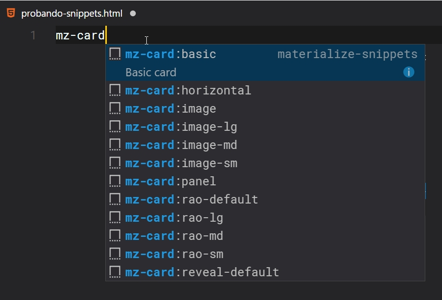

# Materialize CSS Snippets for Visual Studio Code

A set of Materialize CSS Snippets for Visual Studio Code, ordered semantically following the structure of the documentation officer.

## How to install

1. In VScode type `F1` or `Ctrl-Shift-P` (Windows and Linux) or `Cmd-Shift-P` (MacOS). Type install extension and press enter.
2. In the search box, type **materialize snippets** and select it.
3. In the next window with the details of the plugin click on install button, that's it.
4. Reload or restart VScode for the changes to take effect.

## How to use

Snippets are arranged according to the structure of the official documentation of Materialize css, only type **mz-** and the component that you want to use. Example: **mz-card** This will show you all available for the card component snippets.
Remember to put the word **mz-** and then the component that you want to call, **card, btn, table, navbar, sidenav** etc...

# Table of Contents
## Template
| Snippet | Snippet Content | Description |
|---------|-----------------|-------------|
| mz-template: | cnd | Basic html structure using cdn files |
| mz-template: | local | Basic html structure using local files |
| mz-template: | grid | Basic grid structure |

## CSS
### mediacss
| Snippet | Snippet Content | Description |
|---------|-----------------|-------------|
| mz-mediacss: | img-circular | Circular Image |
| mz-mediacss: | img-responsive | Responsive Image |
| mz-mediacss: | video-embeds | Embeds video |
| mz-mediacss: | video-responsive | Responsive Video |

### table
| Snippet | Snippet Content | Description |
|---------|-----------------|-------------|
| mz-table: | bordered | Bordered Table |
| mz-table: | centered | Centered Table |
| mz-table: | default | Default Table |
| mz-table: | highlight | Highlight Table |
| mz-table: | responsive | Responsive Table |
| mz-table: | striped | Striped Table |

### typography
| Snippet | Snippet Content | Description |
|---------|-----------------|-------------|
| mz-typography: | blockquote | Blockquote |
| mz-typography: | flow-text | Responsive Text |

## Components
### badge
| Snippet | Snippet Content | Description |
|---------|-----------------|-------------|
| mz-badge: | default | Default Badge |
| mz-badge: | new | New Badge |

### breadcrumb
| Snippet | Snippet Content | Description |
|---------|-----------------|-------------|
| mz-breadcrumb: | breadcrumb | Breadcrumb|

### buttons
| Snippet | Snippet Content | Description |
|---------|-----------------|-------------|
| mz-btn: | default | Default Button|
| mz-btn: | disabled | Disabled Button|
| mz-btn: | fab-ct-h | Fixed action button click to toggle horizontal|
| mz-btn: | fab-ct-v | Fixed action button click to toggle vertical|
| mz-btn: | fab-h | Fixed action button horizontal|
| mz-btn: | fab-toolbar | Fixed action button toolbar|
| mz-btn: | fab-v | Fixed action button vertical|
| mz-btn: | flat | Button Flat|
| mz-btn: | flat-disabled | Button flat disabled |
| mz-btn: | floating | Button Floating|
| mz-btn: | floating-disabled | Button Floating Disabled|
| mz-btn: | icon-left | Button with icon to the left |
| mz-btn: | icon-right | Button with icon to the right|
| mz-btn: | large | Large Button|
| mz-btn: | large-disabled | Large Button Diasbled|
| mz-btn: | large-icon-left | Large button with icon on the left|
| mz-btn: | large-icon-right | Large button with icon on the right|
| mz-btn: | submit | Submit Button|
| mz-btn: | fab-toolbar | Fixed action button toolbar|

### card
| Snippet | Snippet Content | Description |
|---------|-----------------|-------------|
| mz-card: | basic | Basic Card|
| mz-card: | fab-large| Card with large Floating Action Button|
| mz-card: | fab-small| Card with small Floating Action Button|
| mz-card: | panel | Panel Card|
| mz-card: | horizontal | Horinzontal Card|
| mz-card: | image | Image Card|
| mz-card: | image-lg | Image Card Large|
| mz-card: | image-md | Image Card Medium|
| mz-card: | image-sm | Image Card Small|
| mz-card: | rao-default | Card reveal action option default|
| mz-card: | rao-lg | Card reveal action option large|
| mz-card: | rao-md | Card reveal action option medium|
| mz-card: | rao-sm | Card reveal action option small|
| mz-card: | reveal-default | Card reveal default|
| mz-card: | reveal-lg | Card reveal large|
| mz-card: | reveal-md | Card reveal medium|
| mz-card: | reveal-sm | Card reveal small|

### chips
| Snippet | Snippet Content | Description |
|---------|-----------------|-------------|
| mz-chips: | contact | Chip Contacts|
| mz-chips: | tags | Chip Tags|
| mz-chips: | tags-close | Chip tag with icon close|
